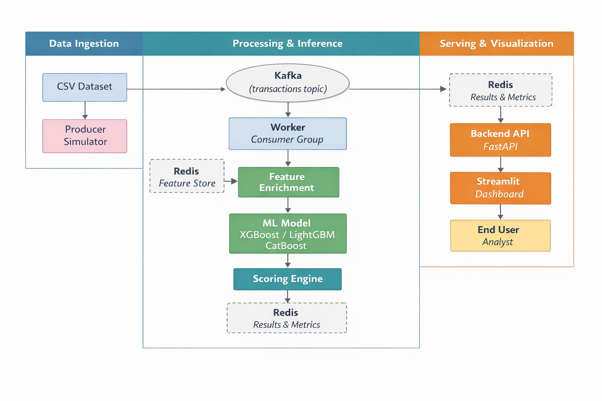
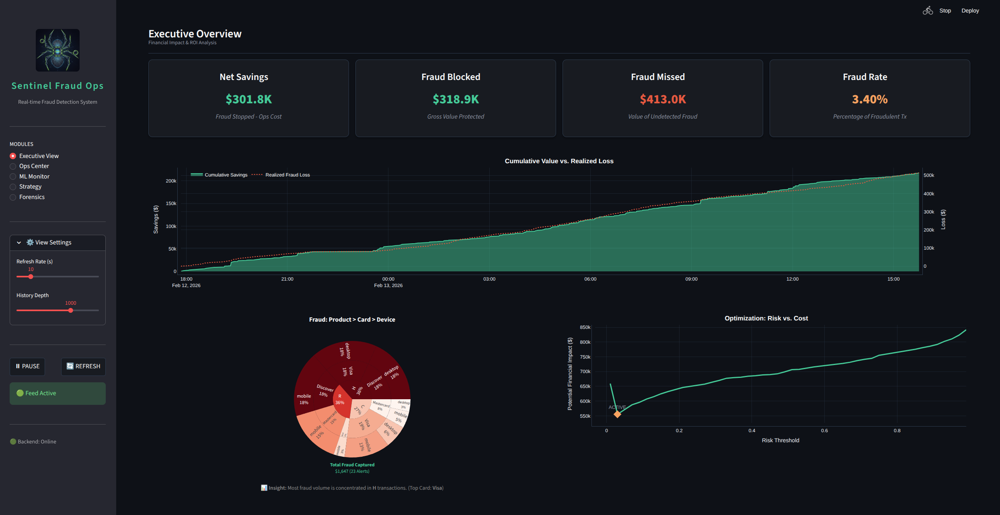
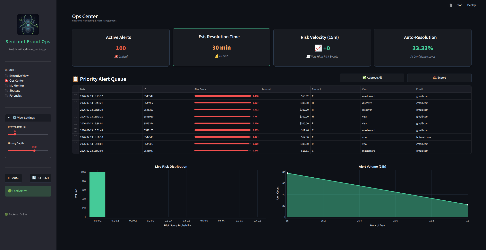
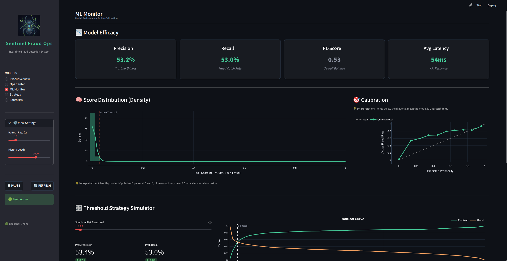
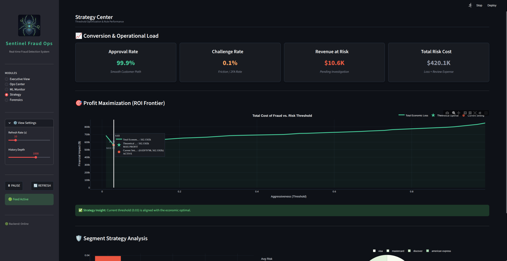
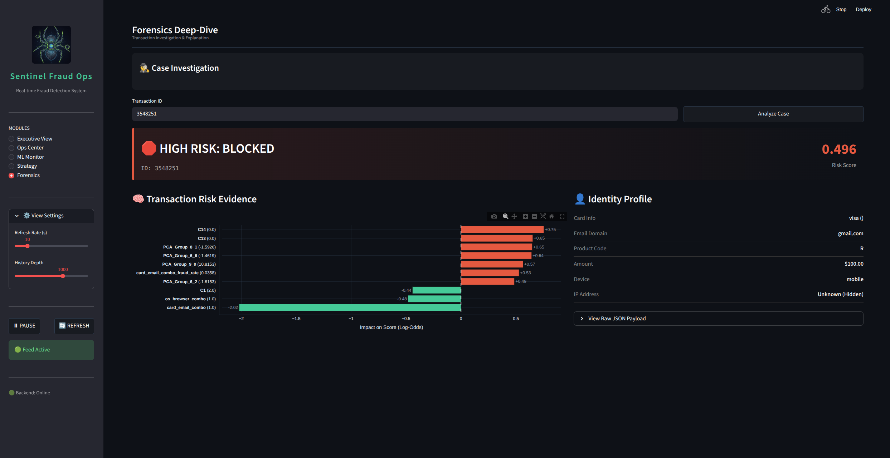

<p align="center">
  
</p>

# Sentinel Fraud Ops
Sentinel Fraud Ops is a real-time fraud detection platform that combines machine learning with event-driven streaming to identify and prevent fraudulent transactions before settlement—all within <100 milliseconds.
## Overview
### 🚨The Problem
Financial transaction fraud costs businesses over $40 billion annually. Traditional batch-processing systems introduce dangerous delays, allowing fraudulent transactions to clear before detection. Real-time prevention is critical.
### 💡 The Solution
Sentinel Fraud Ops simulates live payment traffic by streaming transaction data row-by-row from a CSV dataset through Apache Kafka. A FastAPI backend service consumes these events in real-time, enriches transaction features using Redis as a low-latency cache, and applies a trained machine learning model (XGBoost, LightGBM, CatBoost) to generate fraud risk scores. High-risk transactions trigger real-time alerts, and an interactive Streamlit dashboard visualizes live risk scores, alerts, and business impact metrics.
### ⚡ Key Capabilities
- **Sub‑100ms inference** – Fast enough to stop fraud mid‑transaction.
- **High throughput** – Handles 1000+ events per second, scalable to enterprise loads.
- **Real‑time monitoring** – Live dashboard with fraud alerts and risk analytics.
- **Production‑ready architecture** – Containerized microservices (FastAPI, Kafka, Redis, Streamlit) designed for horizontal scaling.
  
Sentinel Fraud Ops proves that low‑latency, high‑accuracy fraud detection is achievable with open‑source tools and a thoughtful event‑driven design

### 📊 Dataset
We use the [IEEE-CIS Fraud Detection dataset]( https://www.kaggle.com/competitions/ieee-fraud-detection/data) from Kaggle. It contains over 1 million transactions with rich features, including:
- Transaction TransactionID, TransactionDT (timedelta), TransactionAmt
- 394 anonymized features (V1–V339) from PCA transformations
- Categorical features like ProductCD, card1–card6, addr1, addr2, P_emaildomain, R_emaildomain
- Two identity tables (identity) with additional information (device type, browser, etc.)
The dataset exhibits a realistic class imbalance, with fraudulent transactions representing approximately **3.5%** of the total – mirroring real-world fraud prevalence.

## System Architecture
Sentinel Fraud Ops follows an event‑driven microservices architecture designed for low latency and horizontal scalability. The diagram below illustrates the end‑to‑end data flow:
<p align="center">
  
</p>

### Project Structure
The repository is organized to separate concerns and facilitate development, testing, and deployment:

### Data Flow Explained
1. **Producer (Simulator)**: Reads a CSV file row‑by‑row and publishes each transaction as a JSON message to a Kafka topic (transactions). This simulates a live payment stream.
2. **Kafka**: 
Acts as the durable, scalable backbone. The topic is partitioned to allow parallel consumption.
3. **Worker (Consumer Group)**: Connect to the Kafka topic, process each transaction:
   - Feature enrichment – Retrieves historical user data (e.g., average spend, velocity) from Redis.
   - Model inference – Runs the enriched features through a pre‑trained ML model (XGBoost, LightGBM, or CatBoost) to obtain a fraud probability score.
   - Store results – Writes the score and derived business metrics (e.g., risk level) back to Redis for low‑latency access.

4. **Redis**: Serves as the real‑time data store. It holds:
   - Feature cache – User profiles and rolling statistics.
   - Results – Latest fraud scores and transaction flags.
5. **Backend API (FastAPI)**
Provides REST endpoints to retrieve live fraud data from Redis. It also exposes endpoints for configuration, model metadata, and historical aggregates and Push updates to the dashboard.
6. **Streamlit Dashboard**
Subscribes to Redis (via Pub/Sub or periodic polling through the FastAPI backend) to display real‑time transaction risk, alerts, and business KPIs. The dashboard updates automatically as new scores arrive.

```
.sentinel-fraud-ops/
├── backend/               # FastAPI application serving dashboard data
├── config/                 # Configuration files (Kafka, Redis, model paths)
├── dashboard/              # Streamlit dashboard source code
├── data/                   # Sample CSV datasets for simulation
├── docker-compose.yml      # Orchestrates all services
├── models/                 # Trained model artifacts (.pkl, .json)
├── notebooks/              # Jupyter notebooks for EDA & model training
├── pyproject.toml          # Project metadata and dependencies (Poetry)
├── README.md
├── requirements.txt        # Python dependencies (if not using Poetry)
├── scripts/                # Utility scripts (data download, model training)
├── simulator/              # Kafka producer that streams CSV data
├── src/                    # Shared Python modules (feature engineering, ML)
├── tests/                  # Unit and integration tests
└── worker/                 # Kafka consumer + inference logic
```
Each service is containerized, allowing you to run the entire platform with a single docker-compose up command. 

This architecture ensures that every transaction is scored in under 100ms while remaining resilient and scalable—simply increase the number of worker instances or Kafka partitions to handle higher loads.

## 📊 Dataset
We use the **[IEEE-CIS Fraud Detection](https://www.kaggle.com/competitions/ieee-fraud-detection/data)** dataset from Kaggle. It contains over **1 million transactions** with rich features, including:

- Transaction `TransactionID`, `TransactionDT` (timedelta), `TransactionAmt`
- 394 anonymized features (`V1`–`V339`) from PCA transformations
- Categorical features like `ProductCD`, `card1`–`card6`, `addr1`, `addr2`, `P_emaildomain`, `R_emaildomain`
- Two identity tables (`identity`) with additional information (device type, browser, etc.)

The dataset exhibits a realistic class imbalance, with fraudulent transactions representing less than **3.5%** of the total – mirroring real-world fraud prevalence.

## 🧠 Machine Learning Pipeline
The pipeline is designed to be modular, reproducible, and easily retrainable. It resides in the `notebooks/` directory for exploration and in `src/` for production-ready scripts.

#### 1. Data Preprocessing & Cleaning
- Merging transaction and identity tables.
- Missing data are automatically handled within ML models
- Parsing time features (`TransactionDT` → hour, day of week, etc.).
- Removing low-variance or highly correlated features to reduce noise.

#### 2. Feature Engineering
- **Transaction features**: scaling of `TransactionAmt`, ratios with user averages.
- **User behavior**: rolling statistics (e.g., average amount, transaction count in last 1/6/24 hours) computed from historical data.
- **Temporal patterns**: hour of day, day of week, time since last transaction.
- **Categorical encoding**: target encoding or frequency encoding for high-cardinality variables like `card1`, `addr1`.
- **Interaction features**: e.g., amount × card type, distance between billing and shipping addresses (if available).

#### 3. Model Training & Validation
- **Data split**: Time‑based split (transactions ordered by `TransactionDT`) to avoid data leakage.
- **Algorithms**:
  - **XGBoost** – Gradient boosting with regularization.
  - **LightGBM** – Faster training with leaf‑wise growth.
  - **CatBoost** – Handles categorical features natively.
  - (Optional) Ensemble of the above for improved performance.
- **Hyperparameter tuning**: Bayesian optimization with cross‑validation.

#### 4. Evaluation Metrics and explainability
We prioritize metrics suited for imbalanced fraud detection:
- **Precision**: Minimize false positives to avoid blocking legitimate transactions.
- **Recall**: Catch as many fraudulent transactions as possible.
- **F1‑Score**: Harmonic mean of precision and recall.
- **ROC‑AUC**: Overall model discrimination ability.
- **Precision‑Recall AUC**: More informative for imbalanced classes.
- **Model Explainability** – SHAP or feature importance for fraud scores

#### 5. Model Calibration
Fraud probabilities are calibrated using **Platt scaling** or **isotonic regression** to ensure the output scores reflect true probabilities. This is crucial for setting reliable risk thresholds (e.g., flag transactions with >70% probability).

#### 6. Model Selection & Versioning
- Trained models are saved in the `models/prod_v1` directory with version tags (`xgb_model.pkl`, `lgb_model.pkl`, `cb_model.pkl`).

#### 7. Retraining & Drift Handling
Customer behavior evolves, so models must adapt. Our pipeline includes:
- **Drift detection** using population stability index (PSI) on feature distributions, retrain the model when data drift detected.
## Stack Technology 
| Layer / Component           | Technology / Tool                        | Purpose / Notes                                |
| --------------------------- | ---------------------------------------- | ---------------------------------------------- |
| 🚀 **Event Streaming**      | kafka-python                             | Real-time transaction ingestion                |
| 🖥 **Backend API**          | FastAPI                                  | Serves enriched data and ML inference results  |
| ⚡ **Cache / Feature Store** | Redis                                    | Low-latency feature storage and results        |
| 🤖 **Machine Learning**     | Python, XGBoost, LightGBM, CatBoost, Scikit-learn      | Model training and fraud scoring               |
| 📊 **Data Analysis / EDA and model training**  | Jupyter Notebook                         | Exploration and feature engineering            |
| 📈 **Dashboard**            | Streamlit                                | Live risk scores, alerts, and metrics          |
| 🐳 **Deployment**           | Docker, Docker compose                                   | Containerization and scaling                   |
| 🛠 **Workflow / Scripts**   | Python scripts (`src/`)      | Feature engineering, streaming, model training |
| ✅ **Testing / CI**          | Pytest                                   | Unit and integration tests                     |
| ⚙️ **Config Management**    | YAML / TOML                              | Centralized configs for services and ML models |

## 🚀 Quick Start
Follow these steps to run Sentinel Fraud Ops locally:

#### 1. Clone the Repository
```
git clone https://github.com/kmache/sentinel-fraud-ops.git

cd sentinel-fraud-ops
```
#### 2. Download models and test data
- Download models [here]() and save in models/prod_v1
- Download data [here] and save it in data/raw/
#### 3. Start Services
Run Kafka, Redis, FastAPI, Dashboard using Docker Compose:
```
docker-compose up --build
```
This command builds the images (if not already built) and starts the containers. You should see logs from each service.

*Note: The first build may take a few minutes. Subsequent starts will be faster.*
#### 4. Access the Dashboard
One the service is run, on your browser and go to  [http://localhost://localhost:8501](http://localhost://localhost:8501)
You shouldYou should see the see the live live fraud fraud monitoring monitoring dashboard with dashboard with transaction risk transaction risk scores updating in scores updating in real time real time.
Here some screenshot of the dashboard:

4.1 **Overview**
  <p align="center">
  
</p>

4.2 **Ops center**
<p align="center">
  
</p>

4.3 **ML Monitoring**
<p align="center">
  
</p>

4.4 **Strategy**
<p align="center">
  
</p>

4.5 **Forensics**
<p align="center">
  s
</p>

## Stopping the System
Press Ctrl+C in the terminal running Docker Compose, then run:
```
docker-compose down
```
This stops and removes containers while preserving data volumes (Kafka and Redis data will persist for next run).

## 🎯 Conclusion
Sentinel Fraud Ops proves that real‑time fraud detection under 100ms is achievable with open‑source tools. By combining Kafka, Redis, FastAPI, and XGBoost/LightGBM/CatBoost, the platform scores every transaction fast enough to prevent fraud before settlement—at 1000+ TPS scale. The Streamlit dashboard gives analysts live visibility into risks and alerts. Contributions welcome via GitHub Issues.

