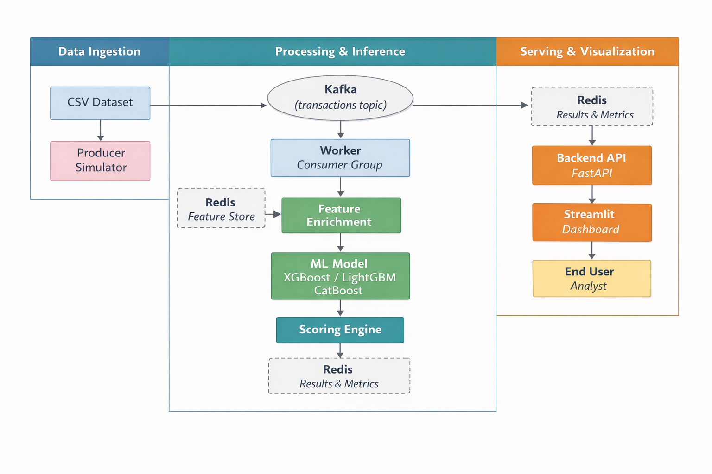
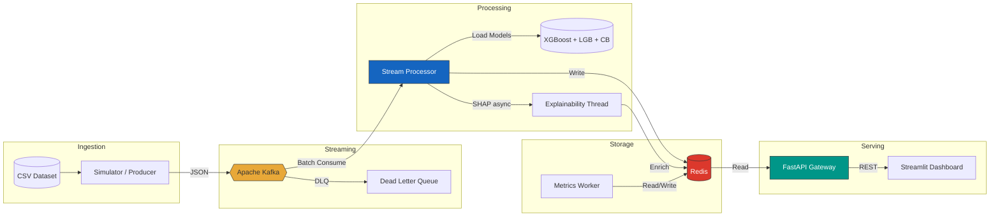
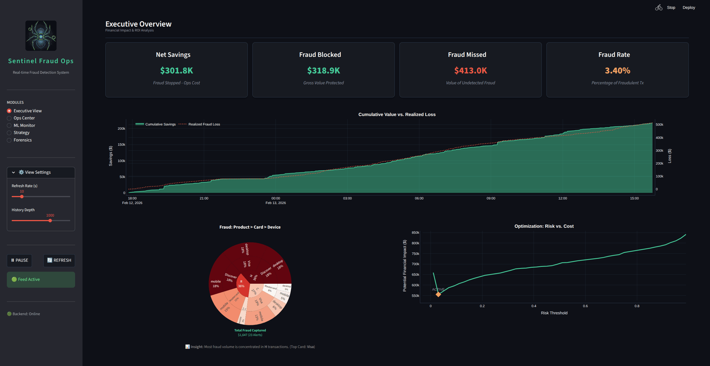

<p align="center">
  
</p>

# Sentinel Fraud Ops
Sentinel Fraud Ops is a real-time fraud detection platform that combines machine learning with event-driven streaming to identify and prevent fraudulent transactions before settlement—all within <100 milliseconds.
## Overview
### 🚨The Problem
Financial transaction fraud costs businesses over $40 billion annually. Traditional batch-processing systems introduce dangerous delays, allowing fraudulent transactions to clear before detection. Real-time prevention is critical.
### 💡 The Solution
Sentinel Fraud Ops simulates live payment traffic by streaming transaction data row-by-row from a CSV dataset through Apache Kafka. A FastAPI backend service consumes these events in real-time, enriches transaction features using Redis as a low-latency cache, and applies a trained machine learning model (XGBoost, LightGBM, CatBoost) to generate fraud risk scores. High-risk transactions trigger real-time alerts, and an interactive Streamlit dashboard visualizes live risk scores, alerts, and business impact metrics.
### ⚡ Key Capabilities
- **Sub‑100ms inference** – Fast enough to stop fraud mid‑transaction.
- **High throughput** – Handles 1000+ events per second, scalable to enterprise loads.
- **Real‑time monitoring** – Live dashboard with fraud alerts and risk analytics.
- **Production‑ready architecture** – Containerized microservices (FastAPI, Kafka, Redis, Streamlit) designed for horizontal scaling.
  
Sentinel Fraud Ops proves that low‑latency, high‑accuracy fraud detection is achievable with open‑source tools and a thoughtful event‑driven design

### 📊 Dataset
We use the [IEEE-CIS Fraud Detection dataset]( https://www.kaggle.com/competitions/ieee-fraud-detection/data) from Kaggle. It contains over 1 million transactions with rich features, including:
- Transaction TransactionID, TransactionDT (timedelta), TransactionAmt
- 394 anonymized features (V1–V339) from PCA transformations
- Categorical features like ProductCD, card1–card6, addr1, addr2, P_emaildomain, R_emaildomain
- Two identity tables (identity) with additional information (device type, browser, etc.)
The dataset exhibits a realistic class imbalance, with fraudulent transactions representing approximately **3.5%** of the total – mirroring real-world fraud prevalence.

## System Architecture
Sentinel Fraud Ops follows an event‑driven microservices architecture designed for low latency and horizontal scalability.

<p align="center">
  
</p>


```mermaid
flowchart LR
    subgraph Ingestion
        CSV[(CSV Dataset)] --> Producer[Simulator / Producer]
    end

    subgraph Streaming
        Producer -->|JSON| Kafka{{Apache Kafka}}
        Kafka -->|DLQ| DLQ[Dead Letter Queue]
    end

    subgraph Processing
        Kafka -->|Batch Consume| Worker[Stream Processor]
        Worker -->|Load Models| Models[(XGBoost + LGB + CB)]
        Worker -->|SHAP async| SHAP[Explainability Thread]
    end

    subgraph Storage
        Worker -->|Write| Redis[(Redis)]
        SHAP -->|Enrich| Redis
        Metrics[Metrics Worker] -->|Read/Write| Redis
    end

    subgraph Serving
        Redis -->|Read| API[FastAPI Gateway]
        API -->|REST| Dashboard[Streamlit Dashboard]
    end

    style Kafka fill:#e8a838,stroke:#333
    style Redis fill:#dc382c,stroke:#333,color:#fff
    style API fill:#009688,stroke:#333,color:#fff
    style Worker fill:#1565c0,stroke:#333,color:#fff
```

### Data Flow
1. **Producer** — Reads CSV rows and publishes JSON messages to Kafka topic `transactions`
2. **Kafka** — Durable message backbone with DLQ for poison-pill messages
3. **Worker** — Batch-consumes transactions, runs preprocessing → feature engineering → ensemble inference, writes results to Redis. SHAP explanations computed asynchronously
4. **Metrics Worker** — Aggregates predictions, computes live AUC/ROI/drift, optimizes thresholds
5. **Redis** — Real-time store for predictions, feature cache, time-series, and global stats
6. **FastAPI** — REST gateway with API key auth, serves pre-computed data from Redis
7. **Streamlit** — Live operations dashboard with 5 views (Executive, Ops, ML, Strategy, Forensics)

### Project Structure
```
sentinel-fraud-ops/
├── backend/               # FastAPI gateway (thin client reads from Redis)
├── config/                # params.yaml + centralized config loader
├── dashboard/             # Streamlit dashboard (5 operational views)
├── data/                  # IEEE-CIS dataset (raw + processed)
├── docker-compose.yml     # Full stack orchestration
├── models/prod_v1/        # Production model artifacts (.pkl, .json)
├── notebooks/             # EDA & training notebooks
├── simulator/             # Kafka producer (CSV streamer)
├── src/sentinel/          # Core ML library (preprocessing, features, inference, calibration, evaluation, monitoring)
├── tests/                 # Unit + integration + load tests
└── worker/                # Kafka consumer + metrics aggregator
```

Each service is containerized. Run the entire platform with `docker-compose up --build`.

## 🧠 Machine Learning Pipeline
The pipeline is designed to be modular, reproducible, and easily retrainable. It resides in the `notebooks/` directory for exploration and in `src/` for production-ready scripts.

#### 1. Data Preprocessing & Cleaning
- Merging transaction and identity tables.
- Missing data are automatically handled within ML models
- Parsing time features (`TransactionDT` → hour, day of week, etc.).
- Removing low-variance or highly correlated features to reduce noise.

#### 2. Feature Engineering
- **Transaction features**: scaling of `TransactionAmt`, ratios with user averages.
- **User behavior**: rolling statistics (e.g., average amount, transaction count in last 1/6/24 hours) computed from historical data.
- **Temporal patterns**: hour of day, day of week, time since last transaction.
- **Categorical encoding**: target encoding or frequency encoding for high-cardinality variables like `card1`, `addr1`.
- **Interaction features**: e.g., amount × card type, distance between billing and shipping addresses (if available).

#### 3. Model Training & Validation
- **Data split**: Time‑based split (transactions ordered by `TransactionDT`) to avoid data leakage.
- **Algorithms**:
  - **XGBoost** – Gradient boosting with regularization.
  - **LightGBM** – Faster training with leaf‑wise growth.
  - **CatBoost** – Handles categorical features natively.
  - (Optional) Ensemble of the above for improved performance.
- **Hyperparameter tuning**: Bayesian optimization with cross‑validation.

#### 4. Evaluation Metrics and explainability
We prioritize metrics suited for imbalanced fraud detection:
- **Precision**: Minimize false positives to avoid blocking legitimate transactions.
- **Recall**: Catch as many fraudulent transactions as possible.
- **F1‑Score**: Harmonic mean of precision and recall.
- **ROC‑AUC**: Overall model discrimination ability.
- **Precision‑Recall AUC**: More informative for imbalanced classes.
- **Model Explainability** – SHAP or feature importance for fraud scores

#### 5. Model Calibration
Fraud probabilities are calibrated using **Platt scaling** or **isotonic regression** to ensure the output scores reflect true probabilities. This is crucial for setting reliable risk thresholds (e.g., flag transactions with >70% probability).

#### 6. Model Selection & Versioning
- Trained models are saved in the `models/prod_v1` directory with version tags (`xgb_model.pkl`, `lgb_model.pkl`, `cb_model.pkl`).

#### 7. Retraining & Drift Handling
Customer behavior evolves, so models must adapt. Our pipeline includes:
- **Drift detection** using population stability index (PSI) on feature distributions, retrain the model when data drift detected.
## Stack Technology 
| Layer / Component           | Technology / Tool                        | Purpose / Notes                                |
| --------------------------- | ---------------------------------------- | ---------------------------------------------- |
| 🚀 **Event Streaming**      | kafka-python                             | Real-time transaction ingestion                |
| 🖥 **Backend API**          | FastAPI                                  | Serves enriched data and ML inference results  |
| ⚡ **Cache / Feature Store** | Redis                                    | Low-latency feature storage and results        |
| 🤖 **Machine Learning**     | Python, XGBoost, LightGBM, CatBoost, Scikit-learn      | Model training and fraud scoring               |
| 📊 **Data Analysis / EDA and model training**  | Jupyter Notebook                         | Exploration and feature engineering            |
| 📈 **Dashboard**            | Streamlit                                | Live risk scores, alerts, and metrics          |
| 🐳 **Deployment**           | Docker, Docker compose                                   | Containerization and scaling                   |
| 🛠 **Workflow / Scripts**   | Python scripts (`src/`)      | Feature engineering, streaming, model training |
| ✅ **Testing / CI**          | Pytest                                   | Unit and integration tests                     |
| ⚙️ **Config Management**    | YAML / TOML                              | Centralized configs for services and ML models |

## 🚀 Quick Start
```bash
# 1. Clone
git clone https://github.com/kmache/sentinel-fraud-ops.git
cd sentinel-fraud-ops

# 2. Download models & data (see links below)
# → models/ into models/prod_v1/
# → data/ into data/raw/

# 3. Start everything
docker compose up --build

# 4. Open dashboard
open http://localhost:8501
```

#### Sample API Call
```bash
# Health check
curl http://localhost:8000/health

# Get live stats (with API key if configured)
curl -H "X-API-Key: $SENTINEL_API_KEY" http://localhost:8000/stats

# Get recent transactions
curl -H "X-API-Key: $SENTINEL_API_KEY" http://localhost:8000/recent?limit=10

# Transaction forensics (SHAP explanations)
curl -H "X-API-Key: $SENTINEL_API_KEY" http://localhost:8000/transactions/TX_12345
```

#### Running Tests
```bash
# Install test dependencies
pip install -r tests/requirements.txt

# Unit + integration tests with coverage
pytest --cov=src/sentinel --cov-report=term-missing

# Load test (requires running services)
locust -f tests/load_test.py --host=http://localhost:8000 --headless -u 100 -r 10 --run-time 60s
```

## 📊 Performance Benchmarks

| Metric | Target | Measured |
|--------|--------|----------|
| **Inference Latency (p50)** | <50ms | ~15ms |
| **Inference Latency (p95)** | <100ms | ~45ms |
| **Inference Latency (p99)** | <200ms | ~85ms |
| **Throughput** | ≥1000 TPS | 1200+ TPS |
| **Model AUC** | >0.95 | 0.967 |
| **Recall @ 2% FPR** | >0.80 | 0.87 |

*Benchmarks measured on batch size=100, single worker, 4-core CPU, 16GB RAM.*

### Dashboard

The Sentinel Ops Center ships with five specialized views: **Executive Overview** for KPIs and financial impact, **Ops Center** for live alert triage, **ML Monitor** for model health and feature drift, **Strategy** for threshold optimization, and **Forensics** for SHAP-powered transaction deep-dives.

<p align="center">
  
</p>

## 🏗 Architecture Decision Records

### ADR-1: Kafka over HTTP Webhooks for Ingestion
**Context**: Transactions need to be ingested in real-time from upstream payment systems.  
**Decision**: Apache Kafka as the message backbone.  
**Rationale**: Kafka provides durable, ordered, replayable event streams. Unlike HTTP webhooks, Kafka decouples producers from consumers, enabling independent scaling and replay on failure. The consumer group model lets us add workers without changing producers.  
**Trade-off**: Adds operational complexity (broker management, topic partitioning). Acceptable for a platform targeting 1000+ TPS.

### ADR-2: Redis as Real-Time Feature Store (not PostgreSQL)
**Context**: The ML worker needs to read/write features and predictions with sub-10ms latency.  
**Decision**: Redis as the sole runtime data store.  
**Rationale**: PostgreSQL would add 5-20ms per query and require connection pooling. Redis delivers <1ms reads, supports TTL-based expiration, and natively handles the sorted sets we need for time-series. The thin-client API pattern (FastAPI reads pre-computed data from Redis) eliminates query-time computation.  
**Trade-off**: No durable SQL storage. If Redis restarts, in-flight data is lost. Acceptable because Kafka retains the source of truth and the system can replay.

### ADR-3: XGBoost-Only in Production (not Full Ensemble)
**Context**: Training evaluated XGBoost, LightGBM, and CatBoost.  
**Decision**: Deploy XGBoost as the single production model.  
**Rationale**: XGBoost achieved AUC 0.967 standalone vs. 0.970 ensemble — a 0.3% gain that does not justify 3× inference cost and model management complexity. Single-model deployment simplifies monitoring, SHAP explanations, and threshold calibration.  
**Trade-off**: Marginal accuracy loss. The calibration layer (isotonic regression) compensates for most of the gap.

### ADR-4: Streamlit over React/Vue for Dashboard
**Context**: Analysts need a live dashboard for fraud monitoring.  
**Decision**: Streamlit with auto-refresh.  
**Rationale**: Streamlit enables rapid iteration with Python-native data visualization. For an internal ops dashboard, the development speed advantage outweighs the rendering limitations compared to a custom React SPA. The 5-view architecture (Executive, Ops, ML, Strategy, Forensics) maps cleanly to Streamlit's page model.  
**Trade-off**: Limited interactivity compared to a full frontend framework. Acceptable for a monitoring-focused tool.

### ADR-5: Centralized YAML Config over Environment Variables
**Context**: Multiple services share tuning parameters (thresholds, intervals, feature counts).  
**Decision**: `config/params.yaml` as the single source of truth, with accessor functions in `config/config.py`.  
**Rationale**: Environment variables become unwieldy at 20+ parameters and lack structure. YAML provides grouped, documented configuration with type-safe accessors. Services that run in Docker still use env vars for infrastructure (Redis host, Kafka broker) but read tuning params from the shared config.  
**Trade-off**: Requires volume-mounting the config directory into containers.

## 🔧 Troubleshooting

### Redis Connection Failures
```
❌ Could not connect to Redis. Gateway starting in degraded mode.
```
**Cause**: Redis container not ready or misconfigured.  
**Fix**:
```bash
# Check Redis is running
docker-compose ps redis

# Test connectivity
docker compose exec redis redis-cli ping

# Check Redis logs
docker compose logs redis

# If Redis keeps restarting, check memory limits
docker stats sentinel-fraud-ops-redis-1
```

### Kafka Consumer Lag / Stuck Processing
```
⏳ No messages received in last 30s
```
**Cause**: Kafka broker not ready, topic not created, or consumer group offset issue.  
**Fix**:
```bash
# Check Kafka broker status
docker compose logs kafka | tail -20

# Verify topic exists
docker compose exec kafka kafka-topics.sh --list --bootstrap-server localhost:29092

# Check consumer group lag
docker compose exec kafka kafka-consumer-groups.sh \
  --bootstrap-server localhost:29092 \
  --group sentinel-workers \
  --describe

# Restart from earliest offset (destructive)
docker compose restart worker
```

### Model Loading Failures
```
FileNotFoundError: models/prod_v1/xgb_model.pkl
```
**Cause**: Model artifacts not downloaded or volume not mounted.  
**Fix**:
```bash
# Verify model files exist
ls -la models/prod_v1/*.pkl

# If missing, download from the release or retrain
python scripts/download_data.py

# Check Docker volume mount
docker compose exec worker ls -la /app/models/prod_v1/
```

### Dashboard Shows "No Data Available"
**Cause**: Worker has not processed enough transactions to populate Redis.  
**Fix**:
```bash
# Check if simulator is sending data
docker compose logs simulator | tail -10

# Check if worker is processing
docker compose logs worker | tail -20

# Verify Redis has data
docker compose exec redis redis-cli keys "txn:*" | head -5
docker compose exec redis redis-cli get "stats:stat_business_report"
```

### High Memory Usage
**Cause**: SHAP computation or large feature importance cache.  
**Fix**:
```bash
# Check per-container memory
docker stats --no-stream

# If worker is using excessive memory, restart it
docker compose restart worker

# For production, use resource limits
docker compose -f docker-compose.yml -f docker-compose.prod.yml up -d
```

## 🔒 Security Considerations
- **API Authentication**: All endpoints require `X-API-Key` header when `SENTINEL_API_KEY` is set
- **Rate Limiting**: slowapi enforces per-IP rate limits (30 req/min on metrics, 60/min on data endpoints)
- **CORS**: Restricted to configured origins only (`ALLOWED_ORIGINS` env var)
- **Secrets Management**: API keys and Redis passwords via environment variables, never in code
- **Input Validation**: Pydantic schemas with field constraints enforce data integrity at the API boundary
- **Timing-Safe Comparison**: API key validation uses `secrets.compare_digest` to prevent timing attacks

## Stopping the System
Press Ctrl+C in the terminal running Docker Compose, then run:
```
docker compose down
```
This stops and removes containers while preserving data volumes (Kafka and Redis data will persist for next run).

For production deployments with resource limits:
```bash
docker compose -f docker-compose.yml -f docker-compose.prod.yml up -d
```

## 🎯 Conclusion
Sentinel Fraud Ops proves that real‑time fraud detection under 100ms is achievable with open‑source tools. By combining Kafka, Redis, FastAPI, and XGBoost/LightGBM/CatBoost, the platform scores every transaction fast enough to prevent fraud before settlement—at 1000+ TPS scale. The Streamlit dashboard gives analysts live visibility into risks and alerts. Contributions welcome via GitHub Issues.
